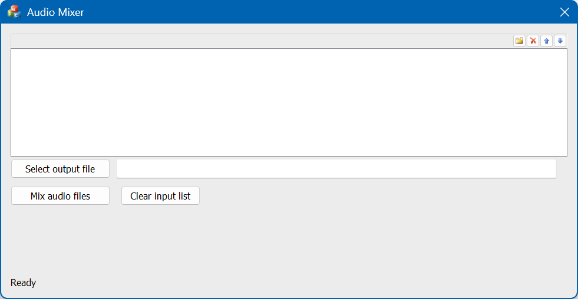

# Audio Mixer (C++)
One of my interests and hobbies is music.  This project is able to mix multiple WAV audio files
into a single audio file, so that the audio from each source WAV file will be heard simultaneously.
This project includes a C++ class that can be used to open, read, and write WAV audio files.  It is
derived from an AudioFile class, and the mixing function uses the AudioFile interface.  That way,
other audio formats (such as FLAC and AIF) could be added in the future and the mixing function
would still work.  For mixing audio files, the source audio files will need to have the same sample
rate and bit rate and same number of channels (mono or stereo).  No external libraries are required.

In addition to the WAVFile class and supporting code, I've included an application for mixing WAV
audio files. The compiled application and the full source code are included in the link at the top
of the article.

This project builds in Visual Studio 2017 (I used the free Community editin).  Note that to build
the project, you will need to have the C++ toolset installed in Visual Studio, along with MFC.  The
code uses modern C++ features, such as std::thread, a lambda function, std::shared_ptr, and a modern
way of iterating through a collection.

Visual Studio can be downloaded
<a href='https://visualstudio.microsoft.com/vs/older-downloads/' target='_blank'>here</a>.
As of this writing (January 2, 2026), that page has versions of Visual Studio from 2015 to 2022.

# Included Applications
The source code includes 2 applications:
<ul>
<li>A GUI application (written in MFC, for Windows) for choosing and mixing WAV audio files
<li>A command-line application (the source being cmdLineApp.cpp) for mixing WAV audio files
</ul>

## GUI application (Windows)
The following is a screenshot of the application:

<p align="center">
  
</p>

To add WAV files to the list, you can drag & drop files onto the GUI, or for each line in the list,
there will be a "..." button that lets you browse and choose a WAV file to add.

## Command-line application
The command-line application source is cmdLineApp.cpp, and there is a makefile to help build everything
in Linux (g++ is used as the compiler).  The command-line application takes a command-line option which
specifies a filename containing a list of WAV audio files to mix (and the last line is the output
filename to use). The command-line also accepts another parameter, -v, to enable verbose output.

# Background
A WAV audio file consists of a header at the beginning of the file, which contains strings to identify
the file type ("RIFF" and "WAVE"), as well as information about the audio contained in the file
(number of channels, sample rate, number of bits per channel, size of the data, etc.). Following the
header is all of the audio data. Digital audio data is numeric: each sample is an integer that
represents the level of the audio signal at that point in time.

The general idea behind digital audio mixing is fairly simple: Until there are no more audio samples,
the next audio sample from each audio file is read, then they're added together and saved to the output
file.  A bit more needs to be done, though, to deal with digital audio clipping.  Digital audio
clipping is caused by numeric range limitations of the values due to the sample size (i.e., 8 or 16
bits): When audio sample values are added together (or if the volume is increased), it's possible for
the resulting values to go beyond the numeric range of the values. When that happens, the result is
(often loud) pops and clicks in the audio, which is undesirable. So, in order to mix WAV files
together, mixAudioFiles() (in AudioFileTools.h and .cpp) will first analyze each audio file to
determine the highest audio sample, then reduce the volume of all the samples while mixing them to
avoid digital audio clipping.

Wikipedia has <a href='https://en.wikipedia.org/wiki/Clipping_(audio)' target='_blank'>an article on
audio clipping</a> that describes it in more detail.

## Using the code
The AudioFile class is a parent class for working with audio files, with some pure virtual methods to
be implemented in derived classes, such as the included WAVFile class.  The WAVFile class can open,
read, and write WAV audio.  Most of the class methods return an AudioFileResultType, which can be used
as if it was a bool (in an 'if' statement, for instance), and if it's false, it contains error messages
in the form of std::string.

The following are some of the more important methods in the WAVFile class:

| Method                                                                                  | Description                                                                                                                                                                                                                |
| --------------------------------------------------------------------------------------- | -------------------------------------------------------------------------------------------------------------------------------------------------------------------------------------------------------------------------- |
| WAVFile(const std::string& pFilename)                                                   | Constructor that takes a filename                                                                                                                                                                                          |
| WAVFile(const std::string& pFilename, const WAVFileInfo& pWAVFileInfo)                  | Constructor that takes a filename and a WAVFileInfo objecct specifying the desired properties of the WAV file (sample rate, bit rate, number of channels, etc.)                                                            |
| WAVFile(const std::string& pFilename, AudioFileModes pFileMode)                         | Constructor that takes a filename and a file mode (read, write, read/write)                                                                                                                                                |
| template <class SampleType> AudioFileResultType getNextSample(SampleType& pAudioSample) | A templatized method that reads the next sample from the audio file (if it's open in read or read/write mode).  For the template, the proper data type must be used (for instance, for 16-bit audio, you can use uint16_t. |
| template <class SampleType> AudioFileResultType writeSample(SampleType pAudioSample)    | A templated method that writes an audio sample to the WAV file (if it's open in write or read/write mode).  For the template, the proper data type must be used (for instance, for 16-bit audio, you can use uint16_t.     |


These are some important methods in the AudioFile class, which are pure virtual:

| Method                                                                 | Description                                                                                                                                                                                                                                                                                                                                                                     |
| ---------------------------------------------------------------------- | ------------------------------------------------------------------------------------------------------------------------------------------------------------------------------------------------------------------------------------------------------------------------------------------------------------------------------------------------------------------------------- |
| virtual AudioFileResultType getNextSample_int64(int64_t& pAudioSample) | Reads the next audio sample from the audio file (if in read or read/write mode).  The audio sample is cast to an int64 so that it can be used in generic algorithms - Whether the audio data is 8-bit, 16-bit, or another bitness, the audio sample is cast to 64-bit.                                                                                                          |
| virtual AudioFileResultType writeSample_int64(int64_t pAudioSample)    | Writes an audio sample to the audio file (if in write or read/write mode).  The sample parameter is an int64_t but will be cast down to the appropriate type when writing the sampel to the audio file.  This is to make generic audio algorithms simpler - Whether the audio data is 8-bit, 16-bit, or another bitness, the audio sample is cast down to the appropriate type. |

AudioFileTools.h and AudioFileTools.cpp defines the following function (among others):

| Method                                                                                             | Description                                                                                                                                                                                                                                                                                                                                                                                                                                                                                                                                                                                                                                                                                                                                |
| -------------------------------------------------------------------------------------------------- | ------------------------------------------------------------------------------------------------------------------------------------------------------------------------------------------------------------------------------------------------------------------------------------------------------------------------------------------------------------------------------------------------------------------------------------------------------------------------------------------------------------------------------------------------------------------------------------------------------------------------------------------------------------------------------------------------------------------------------------------ |
| AudioFileResultType mixAudioFiles(const std::vector<std::string>& pFilenames, AudioFile& pOutFile) | Mixes multiple audio files into a single audio file.  The pFilenames parameter is a vector of strings containing the source filenames, and pOutFile is an AudioFile object representing the audio file where the mixed audio file will be saved.  pOutFile is an AudioFile so that the calling code can decide what format the mixed file should be, and mixAudioFiles() will be able to work with it.  Currently, only WAV is implemented, but in the future, other audio file formats (such as FLAC, AIF, etc.) could be implemented.  Mixing audio files can take some time (due to the file I/O), so if you're using this in a GUI application, it's recommended to do the mixing in a separate thread so that the GUI doesn't freeze. |


The WAVFileInfo and AudioFileInfo classes contain information about the audio files, such as
bitness, number of channels, sample rate, etc.

An example of opening a WAV file and looping through to get each audio sample (assuming the
audio file contains 16-bit audio):
```C++
WAVFile audioFile("someAudioFile.wav");
AudioFileResultType result = audioFile.open(AUDIO_FILE_READ);
if (result)
{
    size_t numSamples = audioFile.numSamples();
    for (size_t i = 0; (i < numSamples) && result; ++i)
    {
        int16_t audioSample = 0;
        result = audioFile.getNextSample(audioSample);
    }
}
else
{
    cerr << "Error(s) getting audio samples:" << endl;
    result.outputErrors(cerr);
}
audioFile.close();
```

## Points of Interest
One interesting thing to note is that data in a WAV audio file is always little-endian, per
the specification. On big-endian systems, the byte order must be reversed before manipulating
the audio data, and the byte order for a sample must be reversed before saving it to a WAV
file. My WAVFile class handles this automatically; for example, if the system is big-endian,
then when retrieving audio samples from a WAV file or adding a 16-bit sample to a WAV file,
the bye order will be automatically reversed so that the data is in the proper order.

In creating the WAVFile class, it was necessary to look up the WAV file format specification.
I found many web pages describing the WAV file format. There were 4 URLs I had referenced
when I originally wrote this, but only one still exists today:
<ul>
<li><a href='http://www.ringthis.com/dev/wave_format.htm' target='_blank'>http://www.ringthis.com/dev/wave_format.htm</a>
</ul>

I also have <a href='https://github.com/EricOulashin/audio_mixer_c_sharp' target='_blank'>a C# version of this</a> which I originally wrote in April 2009.

I originally posted this project <a href='https://codeproject.com/articles/Cplusplus-audio-mixing-and-WAV-file-AudioFile-clas' target='_blank'>on CodeProject</a>.
